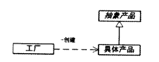
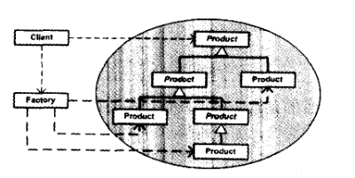
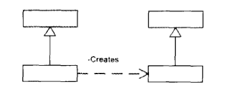
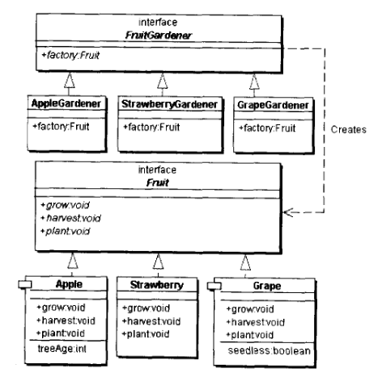
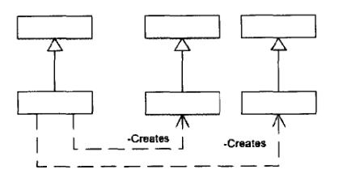
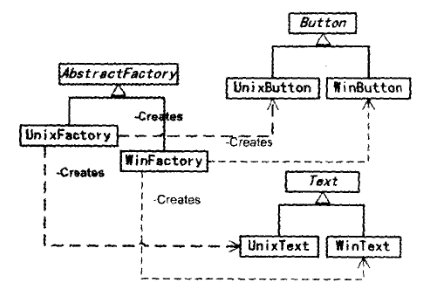

###

简单记录所学的设计模式，本文简单归纳近期所学的创建模式

<!-- more -->

&emsp;&emsp;创建模式即创建对象的设计模式，为什么创建对象需要模式呢？
- ***一方面来说是为了控制对象的生成***
- ***另一方面来说是为了封装对象的具体创建过***

-----

####常见的创建模式包含:
- 单例模式 - singleton
- 多例模式 -multition
- 简单工厂模式 - simple factory
- 工厂方法模式 - factory method
- 抽象工厂模式 - abstract factory
- 建造模式 - builder
- 原型模式 - prototype

**按上述创建模式的初衷，可以将这些设计模式划分为两类：**

1. 控制对象生成的模式：单例、多例模式
2. 封装具体创建过程的模式：工厂、建造和原型模式 

****

### 一. 单例模式
单例模式便是控制对象在系统中只有一个实例。***实现的方式就是将类的构造方式私有化，由内部提供一个获取唯一实例的公有静态方法。*** 除了该类之外的其他类无法通过此方法之外的其他手段创建该类实例，从而保证该类在系统中只有一个实例。
以java为例

```java
//饿汉单例的例子
public class Sample{

    //持有自身实例
    private static Sample instance = new Sample();
    //私有化构造
    private Sample(){}
    //返回实例的静态方法
    public static Sample getInstance(){
        return instance;
    }
}
```

单例的实现基础就是上述的两点，不过针对实例的产生时间又可具体分为 
1. ***饿汉单例*** ：类定义时就赋予一个实例，上面的例子即为饿汉模式
2. ***懒汉单例*** ：在实际调用该类时才在没有实例的情况下创建实例

对于懒汉模式，由于实例的创建被推迟到使用单例类的时候，就有可能在多线程情况下出现 **并发访问**，从而同时生成多个实例，破坏了原有的设计。所以实现上都会使用锁进行控制。如：

```java
//使用同步实现懒汉单例的例子
public class Sample{

    private static Sample instance;
    private Sample(){}
    //加上同步关键字，保证线程安全
    public synchronized static Sample getInstance(){
        if(instance == null){
            instance = new Sample();
        }
        return instance;
    }
}
```

在并发情况下还有一种 ***双重检查*** 的思路，由于在方法上加入同步关键字之后，对该方法的调用，都会对该类进行锁请求和释放操作，这时肯定会比不加锁的情况要更加耗时，尤其是在需要大量使用单例类的情况。

```java
//双重检查
public class Sample{

    private static Sample instance;
    private Sample(){}
    //加上同步关键字，保证线程安全
    public static Sample getInstance(){
        //首次判断
        if(instance == null){
            //同步
            synchronized(Sample.class){
                //第二次判断
                if(instance == null){
                    instance = new Sample();
                }
            }
        }
        return instance;
    }
}
```
双重检查提供了一种降低锁请求次数的思路
####<font color="#dd0000">需要注意的是：</font>
***《java与模式》一书中（第232页）表明，在java语言中这是一种错误的语法***
我在本地测试的结果是并没有报任何异常
关于在java中双重检查的有效性还需要考察


***针对于java，还有一种更好的，利用java特性实现懒汉单例的方式，即依靠内部类的加载来实现。***

-----

### 二. 多例模式
多例模式可以说是单例模式的一种推广
应用：国际化解决方案

-----

### 三. 工厂模式
工厂模式主要应用是将大量有共同接口的类实例化，由工厂类动态决定提供哪种具体类的实例
####1. 简单工厂模式（静态工厂
简单工厂的类图如下


简单工厂模式下，只有一个工厂类负责所有产品类的实例化。下图为多层级产品结构下的简单工厂模式

简单工厂模式的有点即：结构简单，产品等级结构不会反映到工厂类
但是缺点也明显：每当添加产品类，工厂类代码都要做相应的更改

有时为了简化结构会移除抽象产品，或者将工厂类和抽象产品合并
e.g. DateFormate
***换个角度来说，单例模式就是使用了工厂类、产品类合而为一的简单工厂模式***

####2. 工厂方法模式
工厂方法模式类图如下

相比于简单工厂模式，工厂方法模式增加了抽象工厂类，由具体的工厂类实例化对象，因此符合了开闭原则
其中角色分为
* 抽象工厂
* 具体工厂
* 抽象产品
* 具体产品
***为了便于分辨，以下将 产品等级结构 称作 产品系列（《JAVA与模式》一书中一将同一父子级关系内的产品称作产品等级结构）***
工厂方法模式主要用于只有一个产品系列的情况。通常情况下，一个具体工厂对应一个具体产品。当新增具体产品的时候，只需要新增对应的具体工厂，无需对原有的工厂类进行修改。

通常情况的类结构如上图。一般情况的工厂方法模式中，具体工厂锁返回的类型应当是抽象产品，这样才能保证产品的多态性。
***e.g. java collection 中定以的 iterator()就是一个工厂方法***
由于工厂方法模式本身的结构，在产品系列较大的时候，会造需要大量的具体工厂类，使得工厂类泛滥。

####3.抽象工厂模式
抽象工厂是工厂方法模式的拓展，工厂方法模式使用与一个产品系列的场景，而抽象工厂可以使用于有多个相似层级结构的产品系列。

以下是一个案例

相比于工厂方法模式，抽象工厂模式的有点非常明显：适用范围更广，一个工厂系列可以生产若干结构相同的产品系列。同时继承了工厂方法模式“开闭”的优点。
然而当新增产品系列的情况下，不可避免的，需要对整个工厂系列进行修改，增加新产品的工厂方法。

