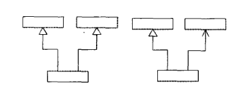
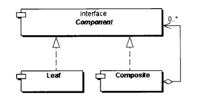
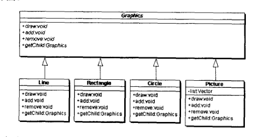
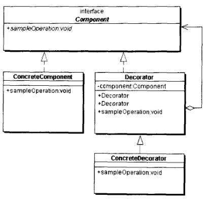

###

<!-- more -->

&emsp;&emsp;说完创建模式，这次总结下结构模式。常见结构模式有
* 适配器模式
* 合成模式
* 装饰模式
* 代理模式
* 享元模式
* 门面模式
* 桥梁模式

结构模式通常是为了增强对象功能、对象控制

### 一. 适配器模式

适配器模式结构如下

左边的是基于类（继承）实现的，右图是基于对象（合成/聚合）实现的
适配器模式的主要目的是在不改变源对象功能的条件下，将其的接口（非java的interface）包装成需要的目标形式（适配模式的目的是为了组合）

适配器模式的两种实现方式各有特点
1. 基于继承的适配器模式：
    - 对于只能单继承的java，一个适配器只能适配一个源到目标
    - 适配器可以置换（重写）源的方法实现
2. 基于合成/聚合的适配器模式：
    - 一个适配器可以适配多个源到目标
    - 不易置换源的方法实现

### 二. 合成模式
合成模式生成的结构是一种树结构，结构如下

该模式中有三种角色
- 抽象组件
- 叶子组件
- 树枝组件，包含叶子组件
根据合成模式的实现可以分为，透明方式的合成模式和安全方式的合成模式
- 透明方式的实现：抽象组件中声明子对象的管理方法（如：add()、remove()）,如此在所有叶子和树枝组件在接口层次上没有区别，但是叶子节点没有子节点，所以运行时有可能会产生异常。
- 安全方式的实现：在树枝组件中声明子类管理方法，这样就不会出现叶子组件调用无意义方法的情况，运行时就不会出现异常。
合成模式的一个使用示例

一张图像可以作为多张图像的组合来表示

### 三.装饰者模式

装饰者模式类图如下

装饰者模式中的角色分为
- 抽象组件
- 实际组件
- 装饰者（定义装饰者的统一接口
- 实际装饰者（实现具体的装饰者接口

装饰者模式的主要目的在于增强对象的功能。装饰者模式也可以实现动态的增强功能和动态的撤销。同时在增强顺序会影响运行结果时很适用。

>使用装饰者模式时，也可以进行简化：
1. 合并实际组件和装饰者 
 